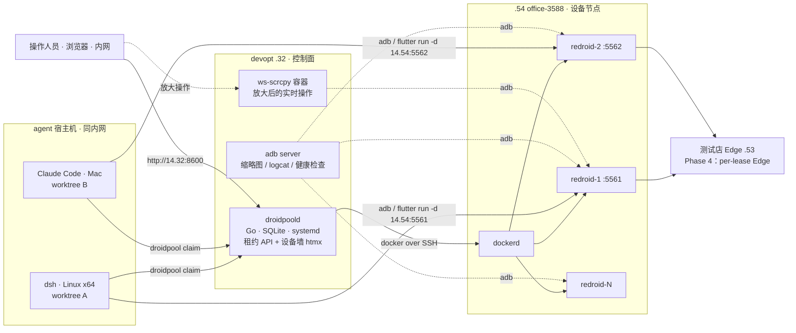

# droidpool 路线图 —— 多 agent 并行开发 cashier-app 的独占 Android 设备池

> 日期：2026-09-03 · 状态：**v3，范围与关键决策已拍板（§1.1），可据此开工**
> 关联：`docs/analysis/2026-09-03` 前两版讨论；memory `office-3588-54-repurposed-redroid-pool`（.54 实测事实）、`cashier-app-avd-test-rig`（adb 驱动 cashier-app 的配方）、`.claude/skills/take-issue`（worktree 开工流程）、`.claude/skills/merge`（worktree 清理）

## 0. 背景与目标

**问题**：多个 agent 各自在 worktree 里改 cashier-app UI，共用一台 Android 设备验证。设备同一时刻只有一个前台，后装的构建覆盖先装的，agent B 上去看到的是 agent A 的界面。单机多包名只解决「覆盖」，解决不了「同时验证」。

**目标**：每个 worktree 开工时拿到一台**独占、干净、可丢弃**的 Android 设备，验证完归还；操作人员在内网网页上像看监控墙一样同时看到所有设备的画面与资源，选中一台放大后可直接操作，必要时接手 agent 的设备再交还。

**整条路线的验收**：两个 agent（一个 DeepSeek harness on Linux、一个 Claude Code on Mac）同时各自 `flutter run` 到自己的设备并跑完登录到开台流程，互不干扰；任一 agent 异常退出后设备在 TTL 内自动回收复位；操作人员在 devopt 的设备墙上看到两台设备的实时画面，放大其中一台接管操作，交还后 agent 继续。

## 1. 决策 · 事实 · 范围 · 不可行项

### 1.1 已拍板（2026-09-03）

| 项 | 决策 |
|---|---|
| 宿主 | `192.168.14.54`（office-3588，Orange Pi 5B）。**Edge 已除役**（实测 `fancycashier` / `fc-updater` unit 已不存在），不在此机上测 Edge |
| 控制面与网页 | 跑在 **devopt `192.168.14.32`**，不在 .54 上；.54 只跑 docker + redroid 容器 |
| agent 形态 | DeepSeek harness（dsh）on Linux x64；Claude Code on Linux / Mac。全部同内网 |
| 网络边界 | 全内网，操作人员电脑也在内网；**不出公网，不走 APISIX / 公网域名** |
| 代码落点 | **独立仓库 `fancyCachier/droidpool`**（命名见 §1.2），不放 big-boss、不放 opt-manual |
| 面板技术 | Go 内嵌 htmx 静态页，零 Node 工具链 |
| 人工介入 | 只做面板高亮，不接通知 |
| 存储 | 不配 SSD，用 .54 自带 116 GB eMMC |
| UAT Cloud 里 .54 门店 | 已除役 |

### 1.2 命名

仓库 **`droidpool`**：控制面二进制 `droidpoold`，agent CLI `droidpool`（`droidpool claim` / `droidpool release`），网页入口称「设备墙」。备选 `droidwall`（偏向面板一面）、`devicepool`（泛，没有 Android 指向）。org 现有仓库均为小写 kebab 单词组合（`paykit`、`dsh-plugins`、`platform-assistant`），`droidpool` 与之一致。

### 1.3 .54 实测事实（2026-09-03 SSH 探测）

| 项 | 实测 | 含义 |
|---|---|---|
| 板型 / CPU | Orange Pi 5B，RK3588S，4×A76 + 4×A55 | 并发上限受大核限制，预期 N_max ≈ 4 |
| 内存 | 16 GB，空闲 14 GB | 6~8 常驻容器可行 |
| 存储 | 仅 116 GB eMMC，ext4 单分区，97 GB 空闲；PCIe 只有板载 WiFi，无空闲 M.2 | 无 reflink → 复位靠 redroid 原生 overlayfs（§5.5）；IO 要在 Phase 1 量化 |
| 系统 / 内核 | Ubuntu 24.04.1，`6.1.0-1025-rockchip`，4K 页 | 不重装 |
| binder | 内建（`BINDER_IPC=y` + `BINDERFS=y`），无模块、无 `/dev/binder*`；手动 `mount -t binder` 成功后已卸回 | 满足 redroid 硬性要求；容器能否自举挂载见 Phase 0 |
| ashmem / memfd | 无 ashmem，有 memfd | 必须 `androidboot.use_memfd=true` |
| IPv6 / DMA-BUF heaps | 均具备 | redroid 五项硬性要求全部通过 |
| GPU | 带 G610 补丁的 `panfrost` 已加载，`/dev/dri/renderD128`、`renderD129` | GPU host 模式有尝试基础 |
| docker | 未安装 | Phase 0 装 |
| 热 | 空载约 30°C | 散热方案待确认 |

### 1.4 剩余假设

| # | 假设 | 若不成立的影响 |
|---|---|---|
| A1 | agent 通过 adb 驱动设备（`screencap` / `uiautomator dump` / `input`），不需要高帧率画面；高帧率只给人看 | 无 |
| A2 | 近期所有设备共用测试店 Edge（.53）；per-lease Edge 放 Phase 4 | Edge 数据层互相污染仍在，见 §7.1 |
| A3 | 各 agent 宿主机自备 Flutter + Android SDK + adb，能构建 cashier-app | 池只发设备，不发构建环境 |
| A4 | devopt 能以 `sa` 免密 SSH 到 .54（docker over SSH 用） | 需先配 devopt → .54 的公钥 |

前两版里「所有 agent 在同一台 Mac 构建、debug keystore 相同」的假设**已消解**：多宿主机 keystore 必然不同，golden 不再预装 app，Edge 端点由 CLI 在安装后写入（§5.5）。

### 1.5 范围边界

- **在范围内**：cashier-app Android 目标的 UI / 交互 / 流程验证；agent 无人值守取用；操作人员观测、放大操作、接管与交还。
- **不在范围内**：Windows 桌面目标、iOS；蓝牙锁、USB 扫码枪 / 打印机等外设；微信登录与推送链路；产品级性能测量（软渲染数据不代表真机）；公网访问。

### 1.6 已识别的不可行 / 不建议项

| 项 | 结论 | 原因 |
|---|---|---|
| 微信登录（fluwx） | 不可测 | redroid 内无微信 App，且 AppID 绑定签名 |
| 扫码（mobile_scanner） | 不可测 | 无相机；ML Kit 依赖 GMS，redroid 无 GMS |
| 蓝牙 / USB 外设 | 不可测 | 容器无蓝牙栈、无 USB 透传 |
| GPU host 模式作为 Day-1 依赖 | 不建议 | 宿主补丁版 panfrost 与容器内 Mesa 的兼容性未知；作为 Phase 1 限时 spike |
| 设备墙全部瓦片走 scrcpy H.264 流 | 不做 | redroid guest 模式无硬编码器，scrcpy 软编码每路吃 .54 一个大核；只在放大时开流，墙面用低帧率截图 |
| 用 DeviceFarmer/STF 整体替代 Phase 2+3 | 不建议 | 无「容器创建 / 复位到 golden」语义；栈重。若自研远程控制做不动，只借它的控制层 |

## 2. 总体架构



| 组件 | 职责 | 落点 |
|---|---|---|
| `droidpoold` | 节点与容器生命周期（docker over SSH）、租约与 TTL、复位、健康检查、缩略图循环、设备墙页面、SSE 状态推送 | devopt，bare 二进制 + systemd（沿用 dev 环境 bare 部署约定） |
| `droidpool` CLI | agent 侧：claim / renew / release / status / seed-edge / shot / ui-dump / request-human / wait-human | agent 宿主机；linux/amd64、linux/arm64、darwin/arm64 三个产物 |
| redroid 容器 | 一租约一容器，`/data-base` 共享只读 + `/data-diff` 私有 | .54 docker |
| ws-scrcpy | 放大视图里的 H.264 流 + 触控 + 键盘 | devopt docker 容器（第三方 Node 应用，不在 devopt 装 Node 工具链） |
| adb server | 缩略图、logcat、健康检查、`run-as` 写配置 | devopt，platform-tools |

**为什么控制面在 devopt 而不是 .54**：.54 的 8 核要全部留给容器；控制面、缩略图缩放、ws-scrcpy 的 H.264 解码转发都放到 devopt；.54 上除 docker 外不装任何东西，坏了重装成本最低。多节点时（第二块板或 ESXi x86 模拟器节点）只是配置里多一段 `[[nodes]]`。

## 3. Phase 0 · 节点与控制面就绪

### 3.1 .54 节点

Edge 已除役，不需要归档动作。剩余：

| 步骤 | 命令 / 动作 | 验收 |
|---|---|---|
| docker | `curl -fsSL https://get.docker.com \| sh && sudo usermod -aG docker sa` | `docker run --rm hello-world` |
| binderfs | 先**不在宿主挂载**，直接起容器（§4.1）看 redroid 在 `--privileged` 下能否自举；不能则宿主 `sudo mount -t binder binder /dev/binderfs` 并写 `/etc/fstab`（`binder /dev/binderfs binder nofail 0 0`） | 容器内 `ls /dev/binderfs` 有 binder/hwbinder/vndbinder |
| 目录 | `sudo mkdir -p /data/droidpool/{base,diff} && sudo chown -R sa /data/droidpool` | — |
| 拉镜像 | `docker pull redroid/redroid:14.0.0_64only-latest` | redroid 文档对 Arm 平台建议 `_64only` |
| 散热 | 确认风扇 / 散热片 | 负载测试前完成 |
| eMMC 基线 | `fio --name=r --rw=randrw --bs=4k --size=1G --runtime=30 --directory=/data/droidpool` | 记录 IOPS 作对照 |
| 台账 | opt-manual `inventory/hosts.toml` 的 `office-3588-sa/root` 条目 tags 改 `["arm", "droidpool-node"]` 并加 note | PR 合入 |

### 3.2 devopt 控制面

| 步骤 | 动作 | 验收 |
|---|---|---|
| SSH | devopt `sa` 生成密钥，公钥加到 .54 `sa` | devopt 上 `ssh sa@192.168.14.54 docker ps` 免密成功 |
| docker CLI | devopt 装 docker CLI（只要客户端），`DOCKER_HOST=ssh://sa@192.168.14.54 docker ps` | 列出 .54 容器 |
| adb | devopt 装 platform-tools | `adb connect 192.168.14.54:5561` |
| ws-scrcpy | `docker run -d --name ws-scrcpy -p 8000:8000 <ws-scrcpy 镜像>`；无 amd64 现成镜像则源码构建 | 浏览器打开 `http://192.168.14.32:8000` 能列出已 connect 的设备 |
| 端口 | droidpoold `:8600`，ws-scrcpy `:8000` | 与 devopt 现有服务（platform-assistant 等）不冲突 |

Android 版本选 14（API 34）；若在该内核上有兼容问题退 13。

## 4. Phase 1 · 发烟测试 + 性能基线

### 4.1 发烟清单

1. 在 .54 起一个容器：
   ```bash
   docker run -d --privileged --name redroid-smoke \
     -v /data/droidpool/smoke:/data -p 5561:5555 \
     redroid/redroid:14.0.0_64only-latest \
     androidboot.use_memfd=true \
     androidboot.redroid_width=1366 androidboot.redroid_height=768 \
     androidboot.redroid_dpi=160 androidboot.redroid_gpu_mode=guest
   ```
   `use_memfd=true` 不可省。**分辨率与密度按收银机实机 Sunmi D1s 2nd 实测取值（1366×768 @ 160 dpi，2026-09-03 adb 读取）**，与目标机逻辑像素一致。第一次启动同时回答 binderfs 自举问题。
2. 从 Mac 和一台 dsh Linux 机各自 `adb connect 192.168.14.54:5561`，两边同时连着，确认多 adb server 并存无异常。
3. `flutter build apk --debug --target-platform android-arm64`，`adb install -r`。
4. 用 `run-as` 推 shared_prefs（Edge .53 端点 + 证书 pin，配方见 `cashier-app-avd-test-rig`）。
5. 启动，`uiautomator dump` 定位「王经理」卡 → PIN×6 → 登录 → 首页出现「球台」content-desc。
6. 开台 → 结账页出现 → 截图存档。
7. **专项 A：渲染器**。Flutter 3.44 默认 Impeller；guest 软渲染下核实 ① 是否正常出图 ② 有无 Vulkan ICD（`dumpsys SurfaceFlinger | grep -i vulkan`）③ 3.44 是否仍保留 Skia 回退，若保留则对比 `--no-enable-impeller` 帧时间。**Impeller 花屏且无 Skia 回退 = 方案重估**。
8. **专项 B：GPU host（限时半天）**。`androidboot.redroid_gpu_mode=host androidboot.redroid_gpu_node=/dev/dri/renderD128` + `--device /dev/dri`。风险在容器内 Mesa 与宿主补丁版 panfrost 的 ioctl 兼容。跑通则重跑 §4.3；跑不通记录 logcat 的 EGL 报错，进 Phase 4。
9. **专项 C：overlayfs 共享 data**。两个容器都挂 `-v /data/droidpool/base:/data-base -v /data/droidpool/diff-{1,2}:/data-diff` 并加 `androidboot.use_redroid_overlayfs=1`，验证 ① 都能启动登录 ② diff 互不可见 ③ `rm -rf diff-1` 重建容器即回到 base。这是 §5.5 的前提。
10. **专项 D：scrcpy 软编码**。从 devopt `scrcpy -s 192.168.14.54:5561 --max-size 1280 --video-bit-rate 2M`，记录 fps 与容器 CPU 增量。决定放大视图的默认分辨率与「同时几路流」的上限。

### 4.2 基线指标

初始合格线是工程判断，Phase 1 跑完按实测修订。

| 指标 | 测法 | 初始合格线（N=1） | 用途 |
|---|---|---|---|
| boot_ready | `docker run` 到 `sys.boot_completed=1` | ≤ 60 s | 预热池大小 |
| install | `adb install -r app-debug.apk`（记录 apk 体积） | ≤ 30 s | agent 迭代节奏 |
| cold_start | `am start -W` 的 TotalTime | ≤ 15 s | debug 基准 |
| login_flow | 脚本：员工卡 → PIN×6 → 登录 → 首页 content-desc 出现 | ≤ 30 s | **主指标** |
| screencap_p95 | `adb exec-out screencap -p` 20 次 | ≤ 2 s | agent 主要观察手段 |
| screencap_cpu | 对 8 台以 1 fps 连续 screencap 时 .54 的 CPU 增量 | 记录 | 设备墙帧率上限 |
| uidump_p95 | `uiautomator dump` 20 次 | ≤ 3 s | agent 主要定位手段 |
| scrcpy_fps / scrcpy_cpu | 专项 D | ≥ 15 fps @1280 | 放大视图体验与并发路数 |
| mem_idle / mem_app | `docker stats --no-stream` | 记录 | N_max |
| cpu_sustained | `docker stats` + `uptime` 5 分钟 | 记录 | N_max |
| temp_max | `/sys/class/thermal/thermal_zone*/temp` | < 80°C | RK3588 约 85°C 降频 |
| data_size | `du -sh base` 与单个 `diff-N` | 记录 | eMMC 97 GB 可支撑多少常驻 |
| emmc_io | 并发时 `iostat -x 1` 的 `%util` / `await` | %util < 80 | eMMC 是否先于 CPU 到顶 |
| reset_time | 释放 → 删 diff → 重建 → boot → ready | ≤ 90 s | 租约周转 |

### 4.3 并发扫描

N ∈ {1, 2, 4, 6, 8}，每档同时起 N 个容器各跑 login_flow 5 轮，记 p50 / p95 / 失败率、temp_max、`dmesg | grep -i oom`、emmc %util。

**N_max**：满足「login_flow p95 ≤ 2 × N=1」且「0 OOM」且「temp_max < 80°C」且「emmc %util < 80」的最大 N。预期约 4。

### 4.4 网络

bridge + 端口映射。测 agent 宿主机到容器的 adb 往返与 screencap 吞吐。mDNS 发现 Edge 在 bridge 下必然失败，方案是 CLI 写端点，不靠发现。

### 4.5 产出与 go/no-go

- `docs/analysis/2026-09-xx-droidpool-性能基线.md`：§4.2 实测值、§4.3 曲线、N_max、四个专项结论。
- `droidpool` 仓库 `bench/`：`smoke.sh`、`login_flow.sh`、`sweep.sh`，可重跑。
- **Go**：N_max ≥ 3 且渲染器无阻断。**No-go**：转 ESXi x86 KVM 模拟器农场评估，Phase 2 设计不变、换 Node driver。

## 5. Phase 2 · 池化与分配接口

Phase 1 的 N_max、boot_ready、reset_time 决定预热池大小与 TTL 默认值；Phase 2 的设计与 CLI 骨架可与 Phase 1 并行，编码收尾等 Phase 1 出数。

### 5.1 部署与配置

`droidpoold` 单二进制，SQLite 存状态，TOML 配置：

```toml
listen = "0.0.0.0:8600"
token  = "..."                       # agent 与面板共用
default_ttl = "4h"
warm_pool = 2
edge_default = { host = "192.168.14.53", port = 8090 }   # seed-edge 默认目标

[[nodes]]
name        = "3588-a"
docker_host = "ssh://sa@192.168.14.54"
adb_host    = "192.168.14.54"
port_range  = [5561, 5568]
max_devices = 4                      # = N_max
image       = "redroid/redroid:14.0.0_64only-latest"
data_root   = "/data/droidpool"
boot_args   = "androidboot.use_memfd=true androidboot.use_redroid_overlayfs=1 androidboot.redroid_width=1366 androidboot.redroid_height=768 androidboot.redroid_dpi=160 androidboot.redroid_gpu_mode=guest"   # = Sunmi D1s 2nd 实测
```

启动时对账各节点 docker 实际容器与 SQLite 记录，孤儿容器回收。健康检查每 30 s `adb shell true`，连续 3 次失败 → `broken` → 自动重建。

### 5.2 数据模型与状态机

```
Node    { name, docker_host, adb_host, port_range, max_devices }
Device  { id, node, container, adb_addr, state, created_at, last_health_at }
Lease   { id, device_id, owner, host, worktree, branch, head_sha,
          created_at, expires_at, human_takeover, human_note,
          edge_mode }                 // Phase 4 预留：shared | dedicated
```

```
creating ──► ready ──► leased ──► resetting ──► ready
                 │                     ▲
                 └───(health ×3 fail)──┴──► broken ──► (recreate) ──► creating
```

`owner` 取 `user@host`，`worktree` 取 git 顶层目录名；幂等键 `(host, worktree)`。

### 5.3 HTTP API（内网，`Authorization: Bearer <token>`）

```
POST   /api/leases                      {owner, host, worktree, branch, head_sha, ttl_min?}
       201 {lease_id, device_id, adb_addr, wall_url, expires_at}
       409 {error:"pool_exhausted", queue_position}
POST   /api/leases/{id}/renew           {ttl_min?}         → 200 {expires_at}
DELETE /api/leases/{id}                                    → 204，设备进 resetting
POST   /api/leases/{id}/human           {takeover:bool, note?}
GET    /api/leases
GET    /api/devices
GET    /api/devices/{id}/thumb.jpg      ?w=480               → 服务端缓存
GET    /api/devices/{id}/screenshot.png                       → 全分辨率，≤ 1 s 缓存
GET    /api/devices/{id}/logcat?tail=200
POST   /api/devices/{id}/reset
GET    /api/nodes                                             → CPU / 内存 / 温度 / 池水位
GET    /api/events                      (SSE)                 → 设备与租约状态变更
GET    /api/health
```

### 5.4 租约语义

- **TTL 到期即强制回收**，不问 agent；agent 异常退出是常态，这是唯一可靠的回收路径。
- `renew` 由 CLI 在每次调用时顺手做，长任务不用显式续约。
- 池满返回 409；CLI 默认轮询最多 10 分钟，超时报错，让 agent 决定等待还是退回本机 AVD。
- 一个 worktree 只能持有一台设备；同一 owner 可持有多台（多 worktree）。

### 5.5 复位、golden 与 Edge 端点

用 redroid 原生 overlayfs（`/data-base` 共享只读，`/data-diff` 实例私有，`androidboot.use_redroid_overlayfs=1`）。复位 = `docker rm -f` → `rm -rf diff-<device>` → `docker run` → boot → ready，**零拷贝**，ext4 eMMC 上成立，reset_time ≈ boot_ready。退路（专项 C 失败时）：`CONFIG_BTRFS_FS=y` 已内建，ext4 上放一个 loop 挂载的 btrfs 镜像承载 `/data/droidpool`，回到 reflink 拷贝，不用重分区。

`droidpoold make-golden <node>` 生成 base：以 `-v base:/data` 起裸容器 → 等 boot → `settings put global window_animation_scale 0`（transition / animator 同）→ `svc power stayon true` → `setprop persist.sys.locale zh-CN` → `setprop persist.sys.timezone Asia/Shanghai` → 关 package verifier → `docker stop && docker rm`。**base 不预装 app**（多宿主机 keystore 不同，预装反而导致 `install -r` 签名冲突）。

Edge 端点由 CLI 在 agent 装完自己的构建后写入：`droidpool seed-edge` 用 `run-as cn.daboshi.cashier_app.dev` 推 shared_prefs（端点 + 证书 pin，pin 由 droidpoold 从 Edge 实时取并缓存），force-stop 后重启生效。`droidpool run` 把「install → seed-edge → am start」串成一步。

### 5.6 agent 侧 CLI 与接入

```bash
droidpool claim [--ttl 4h]       # 读 git 顶层目录名 / 分支 / HEAD；claim 后 adb connect，
                                 # 写 <worktree>/.droidpool 并打印 adb_addr
droidpool addr                   # 供 flutter run -d $(droidpool addr)
droidpool run <apk>              # install -r → seed-edge → am start
droidpool seed-edge [--edge h:p] # 单独写 Edge 端点
droidpool status                 # 租约、到期、human_takeover
droidpool shot [-o f.png]        # 经 droidpoold 取截图
droidpool ui-dump                # uiautomator dump
droidpool release
droidpool request-human "描述"   # Phase 3：请求人工介入并阻塞到交还
droidpool wait-human             # Phase 3：human_takeover=true 时阻塞
```

环境变量 `DROIDPOOL_URL`、`DROIDPOOL_TOKEN`。产物：GitHub Release 的 linux/amd64、linux/arm64、darwin/arm64 三个二进制 + 一行安装脚本；CLI 每次调用比对服务端版本，落后即提示。

接入点：

- **Claude Code**：big-boss `.claude/skills/take-issue/SKILL.md` 第 5 步 `worktree add` 之后加 `droidpool claim`（涉及 cashier-app 时）；`merge` skill 与 take-issue 第 135 行 `worktree remove` 之前加 `droidpool release`；`cashier-app/CLAUDE.md` 真机验证段改为优先 `droidpool`，池不可用退回本机 AVD；现有 `flutter run -d emulator-5554` 一类硬编码改 `-d $(droidpool addr)`。
- **dsh**：`fancyCachier/dsh-plugins` 加一个 `droidpool` 插件，把 claim / release / run / shot / ui-dump 暴露为工具，内部调同一个 CLI。
- `.droidpool` 文件加进各仓库 `.gitignore`。

### 5.7 验收

1. 一个 dsh Linux agent 与一个 Claude Code Mac agent 并发 `claim`，拿到不同 `adb_addr`；各自 `droidpool run` 后跑完 login_flow，截图互不相同且都正确。
2. 杀掉一个 agent 进程不 release，TTL 设 2 分钟，到期设备回到 ready，`pm list packages` 不含 cashier 包。
3. 池满时第 N_max+1 个 claim 收到 409，前一个 release 后 10 s 内拿到设备。
4. `docker rm -f` 一台 leased 容器模拟节点故障，30 s 内 broken → 重建，租约方 `status` 看到 broken。
5. `go test ./...` 覆盖租约状态机、幂等 claim、TTL 回收；变异校验按 big-boss 规范做。

## 6. Phase 3 · 设备墙（观测 + 放大操作 + 人工协作）

### 6.1 两级视图

**墙面（默认页）**：`http://192.168.14.32:8600/`

- 网格自适应，一台设备一格：低帧率缩略图（服务端缩到 480 宽 JPEG，默认 0.5 fps，页面可见时 1 fps）+ 状态徽标 + owner / worktree / branch / HEAD 短 SHA + 剩余 TTL。
- 顶栏：每个节点的 CPU / 内存 / 温度 / 负载，ready / leased / broken 计数。
- 状态变化经 SSE 推送（htmx `sse` 扩展），不整页轮询。
- 有 agent `request-human` 时该格高亮闪烁并置顶。

**放大（点一格进入）**：

- 主区：ws-scrcpy 的 stream 视图内嵌（udid = `ip:port`，H.264 + 触控 + 键盘，默认 `--max-size 1280`，按专项 D 结果定）。
- 侧栏：租约信息、logcat 尾部（SSE 流）、动作按钮：接管 / 交还、延长 TTL、强制释放、复位、下载全分辨率截图、复制 `adb connect` 命令。
- Esc 或点返回回到墙面。

### 6.2 资源纪律（.54 的 CPU 是稀缺品）

- 缩略图循环只在**有浏览器连着 SSE** 时运行；无人看时零开销。
- 墙面帧率上限由 Phase 1 `screencap_cpu` 反推：8 台 × 1 fps 若吃掉超过一个大核，就降到 0.5 fps。
- scrcpy 流**只在放大时开**，同时最多 2 路（专项 D 定），第 3 个人放大时提示「已有 2 路流」。
- 放大视图默认 1280 宽，需要看细节再手动切全分辨率。

### 6.3 人工接管协议

| 步骤 | 操作人员 | agent |
|---|---|---|
| 发起 | 放大视图点「接管」→ `human_takeover=true` | 或 `droidpool request-human "需要人工确认支付"` → 墙面高亮 |
| 进行中 | 在放大视图操作 | `droidpool wait-human` 阻塞；技能约定：驱动 UI 前先 `status` 看标志 |
| 交还 | 点「交还」→ `false` | `wait-human` 返回，继续 |

只做面板高亮，不接通知。

### 6.4 接入与鉴权

内网直连 `http://192.168.14.32:8600`，无域名、无 APISIX。操作人员首次输入 token 存 cookie；API 走 Bearer。ws-scrcpy `:8000` 同样只在内网。adb 端口只在内网。

### 6.5 验收

1. 墙面同时显示 §5.7 两台设备的缩略图与租约信息，状态变化 2 s 内反映。
2. 放大其中一台，触控延迟目测 < 300 ms；点「接管」后 agent 的 `wait-human` 阻塞，「交还」后 5 s 内返回。
3. 关闭所有浏览器 30 s 后，.54 上 screencap 进程消失（`ps` 无残留）。
4. 两个人同时放大两台不同设备，第三个人放大时收到限流提示。

## 7. Phase 4 · 后续（不排期，按痛感触发）

### 7.1 per-lease Edge

所有设备指向 .53 一台 Edge，A 开了斯诺克 1 号台，B 的用例期望它空闲。Edge 是单二进制 + SQLite，arm64 交叉编译配方已有（`CGO_ENABLED=0`）。设计：`claim --edge dedicated` → droidpoold 在节点上起一个 Edge 容器（端口按租约分配，`edge.db` 来自种子库），`seed-edge` 指向它；release 时一并销毁。Lease 的 `edge_mode` 为此预留。放在 .54 上会与 redroid 抢 CPU，届时评估放 devopt 或 edge-dev（.52）。

### 7.2 其他

- GPU host 模式（专项 B 的续篇）。
- 多节点：第二块板，或 ESXi x86 VM + KVM 跑官方模拟器作为另一种 Node driver。
- 录屏：release 前 `scrcpy --record` 留最后 N 分钟，配合 big-boss 的 `attach-image` skill 贴进 PR。
- USB3 SSD：仅当 Phase 1 `emmc_io` 证明 IO 先于 CPU 到顶。
- MCP 封装 CLI（现阶段 CLI + dsh 插件足够）。

## 8. 风险与缓解

| 风险 | 概率 | 影响 | 缓解 |
|---|---|---|---|
| redroid 容器不能自举挂载 binderfs | 低 | Phase 0 多半天 | 内核 binderfs 已实测可挂；宿主 fstab 兜底 |
| Impeller 在软渲染下花屏 / 极慢，且 3.44 已无 Skia 回退 | 中 | 阻断 | 专项 A 前置；不通则 GPU host 或 x86 模拟器农场 |
| RK3588S 持续高负载降频 | 高 | 并发上限缩水 | 确认散热；N_max 由 temp 门控 |
| eMMC 唯一存储：IO 争抢、写放大、寿命 | 中 | N_max 被 IO 压低 | overlayfs 零拷贝复位；`emmc_io` 门控；必要时 USB3 SSD |
| `use_redroid_overlayfs` 在 14 镜像上行为异常 | 低 | 复位机制换实现 | 专项 C 提前验证；退路 loop-btrfs |
| 设备墙缩略图 + scrcpy 软编码把 .54 CPU 吃掉 | 中 | agent 用例变慢 | §6.2 资源纪律；无人看零开销；流路数上限 |
| 多宿主机 adb server 同连一台容器 | 低 | 偶发 adb 断连 | 发烟第 2 步专门验证；devopt 侧只做只读操作 |
| agent 泄漏租约 | 高 | 池被占满 | TTL 强制回收，无例外 |
| ws-scrcpy amd64 镜像构建不顺 | 低 | 放大操作延期 | 墙面先上；退路 STF 控制层 |
| devopt 单点 | 低 | 全体 agent 无法 claim | 已租设备不受影响（adb 直连 .54）；退路 Mac 多开 AVD |
| Edge 数据互相污染 | 高 | 用例偶发失败难归因 | Phase 4 per-lease Edge；短期约定各 agent 用不同球台 |

## 9. 里程碑与工期

| 阶段 | 产出 | 工期（工作日） | 前置 |
|---|---|---|---|
| P0 节点 + 控制面就绪 | .54 docker / binderfs 自举确认 / 镜像 / 散热 / eMMC 基线；devopt SSH / docker CLI / adb / ws-scrcpy | 1 | 建仓 `fancyCachier/droidpool` |
| P1 发烟 + 基线 | 基线文档 + bench 脚本 + 四个专项 + go/no-go | 2 | P0 |
| P2 池化 | `droidpoold` + `droidpool` CLI + take-issue / merge / dsh-plugins 接入 + 验收 | 3 | P1 出 N_max |
| P3 设备墙 | 墙面 + 放大 + 接管协议 + 资源纪律 + 验收 | 3 | P2 |
| 合计 | | 9 | |

## 10. 决策记录

| 问题 | 决定 | 日期 |
|---|---|---|
| 宿主 | .54，Edge 除役 | 2026-09-03 |
| 控制面位置 | devopt .32 | 2026-09-03 |
| 网络边界 | 全内网，不出公网 | 2026-09-03 |
| 代码落点 | 独立仓库 `fancyCachier/droidpool` | 2026-09-03 |
| 面板技术 | htmx 内嵌 | 2026-09-03 |
| 人工介入通知 | 只做面板高亮 | 2026-09-03 |
| SSD | 不配 | 2026-09-03 |
| UAT Cloud 里 .54 门店 | 已除役 | 2026-09-03 |

无待决问题。下一步：建仓、Phase 0。
